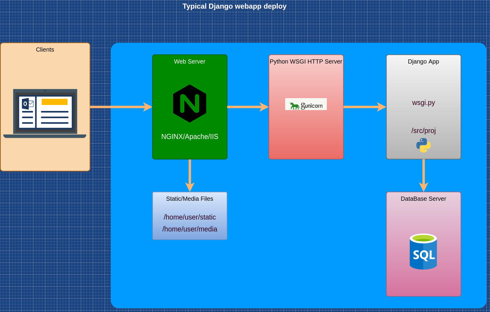

# Dummy hello world Django app

# Webapp deploy to www.pythonanywhere.com
# [Video Instruction](https://youtu.be/D-3xTYR1vBc)

1. Visit and register [https://www.pythonanywhere.com/](https://www.pythonanywhere.com/)
2. Push your project to github
1. Start `bash console` at pythonanywhere
1. Git clone your project to pythonanywhere
1. Create `virtual env`
    1. cd to clonned project dir
    1.
    ```sh
        python3 -m venv env
    ```

1. Activate `venv` and install all dependencies
1. Create `new custom webapp` at pythonanywhere
1. Fill in all the gaps
    1. Source code: - the path to the folder with `manage.py` (/home/denniskot/django-dummy/src)
    1. Virtualenv:
        1. The path to the folder with virtual env (`/home/denniskot/django-dummy/env`)
    1. Static files:
        1. Create in bash conslole folders `static` and `media` on the same level as `src` folder. (/home/denniskot/django-dummy/static and /home/denniskot/django-dummy/media)
        1. Add url `/static/` and directory `/home/denniskot/django-dummy/static`
        1. Add url `/media/` and directory `/home/denniskot/django-dummy/media`
1. `Edit WSGI configuration file` (click the link)
    1. Comment "hello world" section
    2. Find "django" section
        1. Comment out django section
        1. Change `path` to the folder with your 'manage.py' file (`/home/denniskot/django-dummy/src`)
        1. Change `os.environ['DJANGO_SETTINGS_MODULE'] = 'mysite.settings'` 
        where `mysite` is the project/module/folder name with 'settings.py' file
        (`os.environ['DJANGO_SETTINGS_MODULE'] = 'proj.settings'`)

        ```python
        # My WSGI file
        # +++++++++++ DJANGO +++++++++++
        # To use your own django app use code like this:
        import os
        import sys

        # assuming your django settings file is at '/home/denniskot/mysite/mysite/settings.py'
        # and your manage.py is is at '/home/denniskot/mysite/manage.py'
        path = '/home/denniskot/django-dummy/src'
        if path not in sys.path:
            sys.path.append(path)

        os.environ['DJANGO_SETTINGS_MODULE'] = 'proj.settings'

        # then:
        from django.core.wsgi import get_wsgi_application
        application = get_wsgi_application()
        ```
1. Edit settings.py
    1. edit 
        ```python
        ALLOWED_HOSTS = ['yourloginname.pythonanywhere.com',]
        ```
    2. add lines below STATIC_URL
        ```python
        # Change path in *_ROOT according to your static and media path
        MEDIA_URL = '/media/'
        STATIC_ROOT = '/home/denniskot/django-dummy/static'
        MEDIA_ROOT = '/home/denniskot/django-dummy/media'

1. reload webapp
